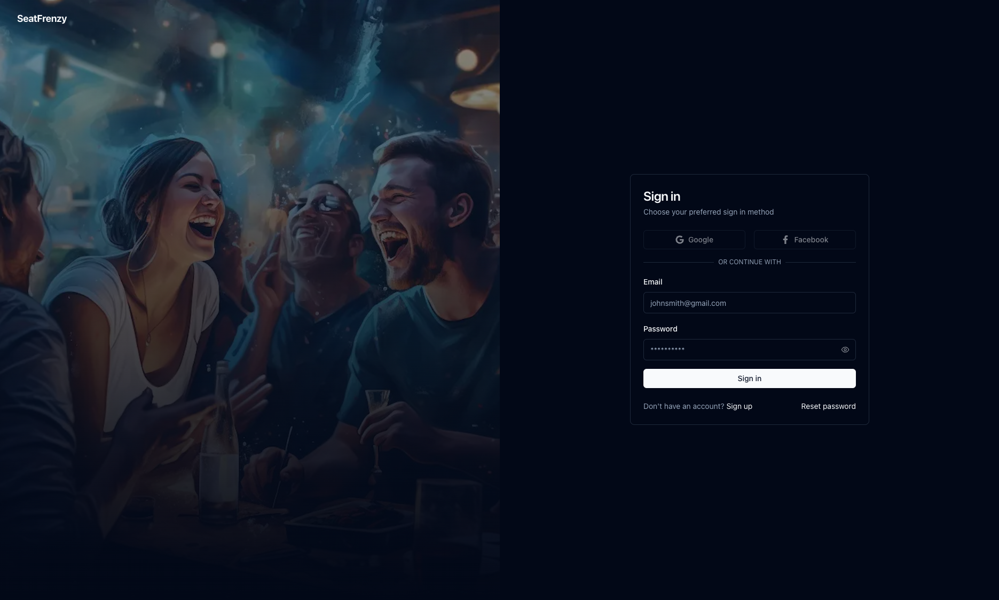
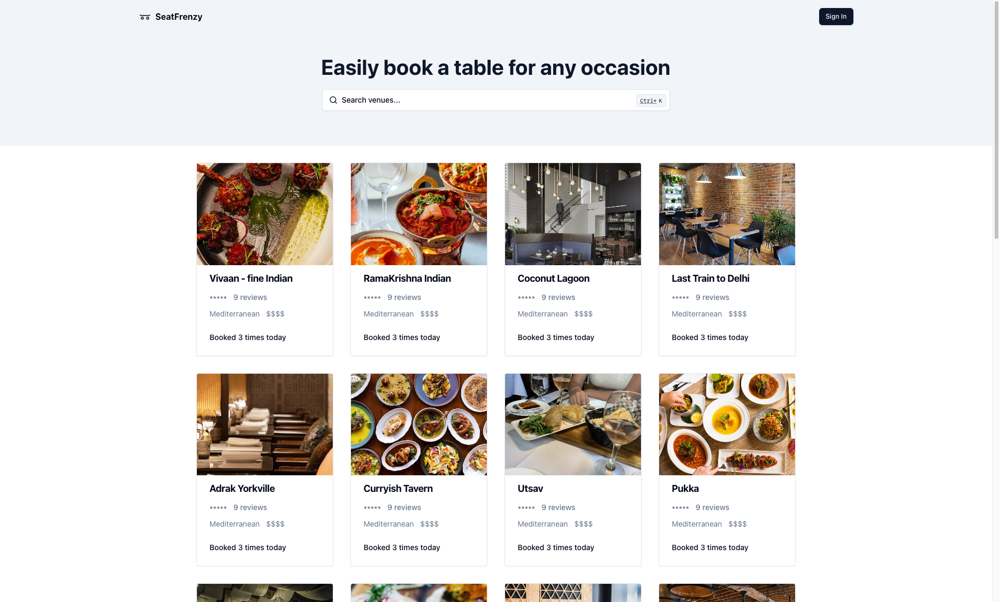
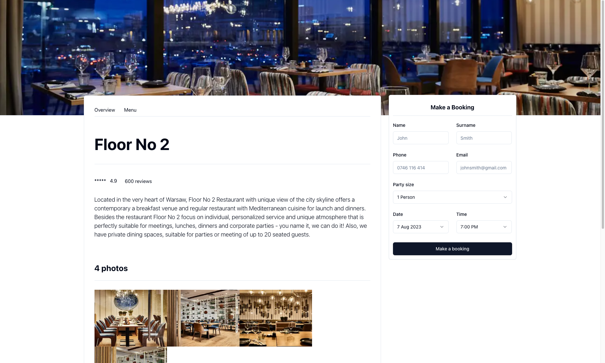

<div>
  <h1 align="center">SeatFrenzy</h1>
  <h3 align="center">Restaurant Table Booking System</h3>
  <p align="center">
    <a href="https://github.com/pjborowiecki/SeatFrenzy-Restaurant-Table-Booking-System.git/issues">Report Bug</a>
    ·
    <a href="https://github.com/pjborowiecki/SeatFrenzy-Restaurant-Table-Booking-System.git/issues">Request Feature</a>
  </p>
</div>

<!-- TABLE OF CONTENTS -->
<details>
  <summary>Table of Contents</summary>
  <ol>
    <li><a href="#about-the-project">About The Project</a></li>
    <li><a href="#feedback-received">Tech Stack</a></li>
    <li><a href="getting-started">Getting Started</li>
    <li><a href="#contributing">Contributing</a></li>
    <li><a href="#license">License</a></li>
    <li><a href="#contact">Contact</a></li>
  </ol>
</details>

<!-- ABOUT THE PROJECT -->

## About the Project

**SeatFrenzy** is a restaraunt booking system, allowing visitors to quickly check availability and easily book a table at their favourite restaurant. It also allows restaurant owners to promote their venues by listing them on the website, and to manage their bookings or information displayed on the website.

The goals is not only to make it a table booking system, but also a full restaurant management system, allowing restaurant owners to manage their bookings, menus, and other information displayed on the website.

<br />

> **Warning**
> This project is still in active development.
>
> It uses new technologies (server actions, serverless database connection, etc. ), which are subject to change and may break your application.
> It is not recommended to use this project in production yet.

<br />







<p align="right">(<a href="#readme-top">back to top</a>)</p>
<br>

<!-- TECH STACK -->

## Tech Stack

- **Framework:** [Next.js 14](https://nextjs.org)
- **Styling:** [Tailwind CSS](https://tailwindcss.com)
- **UI Components:** [shadcn/ui](https://ui.shadcn.com)
- **Database:** [PlanetScale MySQL](https://planetscale.com/)
- **ORM:** [Drizzle ORM](https://orm.drizzle.team/)
- **Authentication:** [Next-Auth](https://nextauth.org/)
- **File Upload:** [UploadThing](https://uploadthing.com/)
- **Forms:** [React Hook Form](https://react-hook-form.com)
- **Email:** [React Email](https://react.email)
- **Validation:** [Zod](https://zod.dev/)
- **Hosting:** [Vercel](https://vercel.com)
- **Project Management:** [Jira](https://www.atlassian.com/software/jira)

<p align="right">(<a href="#readme-top">back to top</a>)</p><br>

<!-- GETTING STARTED -->

## Getting Started <br><br>

#### Prerequisites:

- [Node.js (version 18 or higher)](https://nodejs.org)
  <br>

#### Installation:

<br>

1.  Clone the repo

    ```sh
    git clone
    ```

    <br>

2.  Install packages

    ```sh
     pnpm install
    ```

    <br>

3.  Rename a `.env.example` file in the project's root directory and fill in the required values. See below for details on obtaining the keys:
    <br>

    - **PlanetScale:** <br><br>

      - Create a new account with [PlanetScale](https://planetscale.com)
      - _ToDo:_ Complete the setup instructions <br><br>

    - **OAuth Credentials:** <br><br>

      - _ToDo:_ Complete the setup instructions <br><br>

    - **NextAuth:** <br><br>

      - _ToDo:_ Complete the setup instructions <br><br>

    - **Resend:** <br><br>

      - _ToDo:_ Complete the setup instructions <br><br>

    - **UploadThing:** <br><br>

      - Create a new account with [UploadThing](https://uploadthing.com)
      - _ToDo:_ Complete the setup instructions <br><br>

<p align="right">(<a href="#readme-top">back to top</a>)</p><br>

<!-- CONTRIBUTING -->

## Contributing

Contributions are what make the open source community such an amazing place to learn, inspire, and create. Any contributions you make are **greatly appreciated**.

If you have a suggestion that would make this better, please fork the repo and create a pull request. You can also simply open an issue with the tag "enhancement".
Don't forget to give the project a star! Thanks again!

1. Fork the Project
2. Create your Feature Branch (`git checkout -b feature/AmazingFeature`)
3. Commit your Changes (`git commit -m 'Add some AmazingFeature'`)
4. Run code formatting (`pnpm format`)
5. Run code linting (`pnpm lint`)
6. Push to the Branch (`git push origin feature/AmazingFeature`)
7. Open a Pull Request

<p align="right">(<a href="#readme-top">back to top</a>)</p>

<!-- LICENSE -->

## License

Distributed under the MIT License.

Permission is hereby granted, free of charge, to any person obtaining a copy
of this software and associated documentation files (the "Software"), to deal
in the Software without restriction, including without limitation the rights
to use, copy, modify, merge, publish, distribute, sublicense, and/or sell
copies of the Software, and to permit persons to whom the Software is
furnished to do so, subject to the following conditions:

The above copyright notice and this permission notice shall be included in all
copies or substantial portions of the Software.

THE SOFTWARE IS PROVIDED "AS IS", WITHOUT WARRANTY OF ANY KIND, EXPRESS OR
IMPLIED, INCLUDING BUT NOT LIMITED TO THE WARRANTIES OF MERCHANTABILITY,
FITNESS FOR A PARTICULAR PURPOSE AND NONINFRINGEMENT. IN NO EVENT SHALL THE
AUTHORS OR COPYRIGHT HOLDERS BE LIABLE FOR ANY CLAIM, DAMAGES OR OTHER
LIABILITY, WHETHER IN AN ACTION OF CONTRACT, TORT OR OTHERWISE, ARISING FROM,
OUT OF OR IN CONNECTION WITH THE SOFTWARE OR THE USE OR OTHER DEALINGS IN THE
SOFTWARE.

<p align="right">(<a href="#readme-top">back to top</a>)</p>

<!-- CONTACT -->

## Contact

Piotr Borowiecki - [@pjborowiecki](https://www.linkedin.com/in/pjborowiecki/) - hello@pjborowiecki.com

<p align="right">(<a href="#readme-top">back to top</a>)</p>
